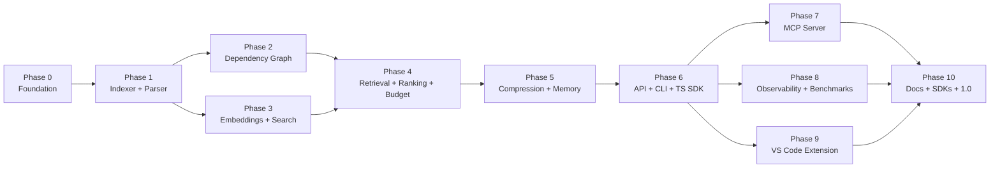

# ContextOptimizer — Roadmap

A production-grade, open-source **AI Context Optimization Engine**: middleware between any AI coding assistant (Cursor, Claude Code, Kiro, Codex CLI, Gemini CLI, VS Code extensions, …) and a repository. It retrieves the *minimum* context needed to solve a task within a configurable token budget.

**Goals:** 30–80% token reduction · better retrieval quality · language-agnostic · modular · stable SDK + REST API.

---

## Guiding Principles

- **Clean architecture** — core domain logic has zero framework dependencies. Fastify, MCP, CLI, and the VS Code extension are thin adapters over the same engine.
- **Interfaces first** — every replaceable component (embedder, vector store, database, parser, ranker, compressor) is defined by an interface in a shared `core` package before any implementation exists.
- **Each phase ships something usable** — no phase ends with only internal plumbing; there is always a way to run and verify it.
- **Tests per module** — every package is independently testable with Vitest; no circular dependencies (enforced in CI).

## Monorepo Layout (target)

```
contextoptimizer/
├── packages/
│   ├── core/            # Interfaces, domain types, Zod schemas, DI container, errors
│   ├── indexer/         # Repo scanner, incremental indexing, symbol table
│   ├── parser/          # tree-sitter AST parsing (per-language grammars)
│   ├── graph/           # Dependency graph build + traversal
│   ├── embeddings/      # Embedding interface + OpenAI / Voyage / local providers
│   ├── vector-store/    # Vector store interface + LanceDB / sqlite-vss adapters
│   ├── storage/         # SQLite (default) + Postgres adapter
│   ├── retrieval/       # Context retrieval engine
│   ├── ranking/         # Multi-factor ranking
│   ├── compression/     # Dedupe, merge, summarization
│   ├── memory/          # Project memory + conversation summaries
│   ├── cache/           # AST / embedding / retrieval / summary / prompt caches
│   ├── tokenizer/       # Token counting + budget management
│   ├── observability/   # Metrics, tracing, Pino logging
│   ├── engine/          # Facade composing all of the above (the public engine API)
│   ├── sdk-ts/          # TypeScript SDK (wraps engine or REST)
│   └── sdk-python/      # Python SDK (wraps REST)
├── apps/
│   ├── api/             # Fastify REST server
│   ├── cli/             # `omni` CLI
│   ├── mcp-server/      # MCP server (stdio + HTTP transports)
│   ├── vscode-ext/      # VS Code extension
│   └── docs/            # Docusaurus site
├── benchmarks/          # Retrieval benchmark harness + datasets
└── .github/workflows/   # CI
```

---

## Phase 0 — Foundation & Scaffolding

**Goal:** a monorepo where every later phase has a home, with CI green from day one.

- pnpm workspace + Turborepo pipeline (`build`, `test`, `lint`, `typecheck`).
- Biome for formatting + linting; strict TypeScript config shared via `tsconfig.base.json`.
- Vitest wired at the workspace level.
- `packages/core`: all foundational **interfaces and types** — `Symbol`, `Chunk`, `ContextRequest`, `ContextResponse`, `Embedder`, `VectorStore`, `StorageAdapter`, `Ranker`, `Compressor`, `TokenCounter` — plus Zod schemas, error types, and a lightweight DI container.
- Pino logger setup in `observability` (skeleton).
- GitHub Actions CI: install → lint → typecheck → test → build; dependency-cycle check (e.g. `madge`).
- Dockerfile skeleton, `LICENSE`, `CONTRIBUTING.md`, issue templates.

**Exit criteria:** `pnpm build && pnpm test && pnpm lint` all pass in CI; core interfaces reviewed and stable enough to build against.

---

## Phase 1 — Repository Indexer + AST Parser

**Goal:** point the engine at any repo and get a queryable symbol table.

- **Indexer:** repo scanner (gitignore-aware), file metadata (hash, size, language, mtime), change detection via content hashes, **incremental re-indexing** of only changed files.
- **Parser:** tree-sitter integration with per-language extractors. Languages in order: **TypeScript, JavaScript, Python** first; then **Go, Rust, Java, C, C++**. Extract classes, functions, methods, imports, exports, comments/docstrings, and intra-file references.
- **Storage:** SQLite schema (files, symbols, imports, chunks) behind the `StorageAdapter` interface; migrations system.
- **AST cache** keyed by file hash (first cache from the `cache` package).
- Minimal internal API: `index(repoPath)`, `getSymbols(query)`, `getFile(path)`.

**Exit criteria:** indexing a mid-size repo (~2k files) completes in reasonable time; re-index after touching 1 file only reprocesses that file; symbol extraction covered by fixture tests per language.

---

## Phase 2 — Dependency Graph

**Goal:** a traversable graph connecting files and symbols.

- Graph builder over indexer output: nodes = files + symbols; edges = imports, exports, calls, references, containment.
- Cross-file symbol resolution (import → definition).
- **Traversal by distance:** `neighbors(node, depth, edgeKinds)` — e.g. "everything within 2 hops of `AuthService`".
- Persist graph in SQLite; incremental updates when files change.
- Graph metrics used later by ranking: in-degree (popularity), centrality.

**Exit criteria:** given a symbol, retrieve callers/callees/importers with correct results on test fixtures; graph updates incrementally without full rebuild.

---

## Phase 3 — Embeddings + Semantic Search

**Goal:** natural-language search over the codebase.

- `Embedder` interface implementations: **OpenAI**, **Voyage**, **local** (e.g. transformers.js / Ollama), plus a deterministic fake for tests.
- Chunking strategy: symbol-level chunks with header context (file path, enclosing class, signature).
- `VectorStore` implementations: **LanceDB** (primary) and **sqlite-vss** (zero-extra-dependency fallback).
- **Embedding cache** keyed by (provider, model, chunk hash) — never re-embed unchanged code.
- Hybrid search: vector similarity + keyword/symbol-name match (BM25-ish) merged.
- Batching, rate limiting, and retry for remote embedding providers.

**Exit criteria:** `search("where is auth token refreshed")` returns the right symbols on a test repo; swapping embedder or vector store requires zero changes outside config.

---

## Phase 4 — Context Retrieval, Ranking 

**Goal:** the heart of the product — `getContext(task) → ranked snippets `.

- **Retrieval engine:** given current file, cursor position, task description, and conversation summary → candidate set from semantic search + graph expansion + git signals (diff, recently changed files) + related tests/docs.
- **Ranking:** weighted multi-factor scorer — semantic similarity, dependency distance, open files, git diff overlap, recent edits, cursor proximity, recency, popularity (graph in-degree). Weights configurable; interface allows pluggable rankers.
- **Tokenizer package:** accurate token counting (tiktoken-compatible) per model family.
- **Retrieval cache** with incremental invalidation on file change.

**Exit criteria:** end-to-end `getContext()` returns relevant, context on realistic tasks; ranking factors individually unit-tested; measurably better than naive "top-k similarity" on internal fixtures.

---

## Phase 5 — Prompt Compression + Memory

**Goal:** shrink what retrieval returns without losing facts.

- **Compression pipeline:** exact + near-duplicate removal → overlapping-chunk merging → code summarization (signature + docstring skeletons for low-rank items) → doc summarization → conversation summarization. Each stage is a pluggable `Compressor`; factual-preservation guardrails (never drop signatures, types, or referenced identifiers).
- **Memory store:** project summary, architecture notes, coding conventions, frequently-used symbols, conversation summaries, previous retrievals — persisted in SQLite, exposed via `remember` / `recall` APIs.
- **Summary cache** and **prompt cache** with invalidation tied to source hashes.
- Compression telemetry: tokens in vs. tokens out per stage.

**Exit criteria:** compression achieves meaningful reduction on real retrieval outputs with no loss of referenced identifiers (verified by tests); memory survives restarts and feeds back into retrieval.

---

## Phase 6 — Engine Facade, REST API, CLI & TypeScript SDK

**Goal:** stable public surfaces over the engine.

- `packages/engine`: single facade wiring all modules via DI — the one entry point every adapter uses.
- **Fastify REST API** (`apps/api`) with Zod-validated routes:
  `POST /index` · `POST /context` · `POST /search` · `POST /memory` · `POST /compress` · `POST /budget` · `POST /graph` · `POST /symbols` — plus `GET /health` and OpenAPI spec generation.
- **CLI** (`apps/cli`): `omni index`, `omni search`, `omni context`, `omni memory`, `omni budget`, `omni graph`, `omni doctor` (env/config/index health checks).
- **TypeScript SDK** (`packages/sdk-ts`): typed client for both in-process (embed the engine) and remote (REST) usage.
- Docker image for the API server; config via file + env vars.

**Exit criteria:** full workflow works from a clean machine: `omni index` → `omni context "fix the login bug"` → budgeted context printed; REST API integration-tested; SDK published as pre-release.

---

## Phase 7 — MCP Server

**Goal:** first-class integration with Cursor, Claude Code, Kiro, and any MCP client.

- `apps/mcp-server` using the official MCP SDK; **stdio** and **streamable HTTP** transports.
- Tools: `search_symbols`, `find_dependencies`, `retrieve_context`, `project_summary`, `search_docs`, `conversation_summary`, `budget_context`, `compress_prompt`.
- Zod-derived JSON schemas for every tool; concise tool descriptions optimized for agent use.
- Tested against Cursor and Claude Code with documented setup snippets for each client.
- One-line install (`npx @contextoptimizer/mcp`).

**Exit criteria:** the MCP server is usable end-to-end inside Cursor and Claude Code against a real repo; all 8 tools return correct, budget-aware results.

---

## Phase 8 — Observability & Benchmarks

**Goal:** prove the value proposition with numbers.

- **Metrics** (in `observability`, surfaced via API + CLI): retrieved tokens, compressed tokens, saved tokens, end-to-end latency, per-stage latency (embedding, ranking, compression), cache hit ratios.
- Prometheus-format `/metrics` endpoint; structured Pino logs with request IDs.
- **Benchmark harness** (`benchmarks/`): task datasets over open-source repos; baselines = naive retrieval (whole files), entire-repo dump, simple RAG (top-k similarity). Measured: retrieval accuracy (recall of ground-truth files/symbols), latency, token savings.
- Reproducible benchmark reports committed to the repo; regression tracking in CI (nightly).

**Exit criteria:** published benchmark showing token savings in the 30–80% range with equal-or-better retrieval accuracy vs. simple RAG.

---

## Phase 9 — VS Code Extension

**Goal:** visual companion + reference client.

- Index the open workspace via the engine (in-process or local API).
- Panels: retrieved context preview for a query, token estimates + savings, dependency-graph visualization (webview), ranking-score breakdown per snippet.
- Editor signals fed into retrieval: open files, cursor position, recent edits.
- Status bar: index freshness, cache hit ratio, last-query token savings.

**Exit criteria:** extension published to the marketplace (pre-release channel); a user can index, query, and visually inspect why each snippet was chosen.

---

## Phase 10 — Python SDK, Postgres, Docs & 1.0 Release

**Goal:** open-source launch readiness.

- **Python SDK** (`packages/sdk-python`): typed REST client, published to PyPI.
- **Postgres adapter** implementing `StorageAdapter` (+ pgvector option for the vector store).
- **Docusaurus site:** architecture + sequence diagrams (Mermaid), developer guide, plugin/provider guide (how to add an embedder, language, vector store), API reference (from OpenAPI), SDK guides, contribution guide, deployment guide (Docker/compose).
- Hardening: API auth (token), rate limiting, graceful degradation when embedding providers are down.
- Release engineering: changesets-based versioning, npm/PyPI publish workflows, Docker images on ghcr.io, semver policy for API/SDK stability.
- Community: good-first-issues, roadmap board, architecture decision records.

**Exit criteria:** `v1.0.0` tagged; docs deployed; a new contributor can add a language or embedding provider using only the plugin guide.

---

## Post-1.0 (Backlog)

- Rust SDK; native core hot-paths (parsing/graph) if profiling justifies it.
- Multi-repo / monorepo-workspace awareness; remote/shared index server for teams.
- Learned ranking (train weights on feedback signals); reranker model support.
- JetBrains plugin; Codex CLI / Gemini CLI first-party recipes.
- Real-time index sync via LSP or file-watcher daemon mode.

---

## Phase Dependency Overview



Phases 2 and 3 can proceed in parallel after Phase 1; Phases 7–9 can proceed in parallel after Phase 6.
