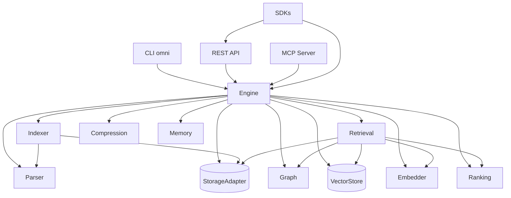

# Architecture Overview

ContextOptimizer is a modular monorepo. Each package implements a narrow interface from `@contextoptimizer/core`.

## Packages

| Package | Role |
|---------|------|
| `core` | Types, interfaces, Zod schemas |
| `parser` | tree-sitter symbol extraction |
| `indexer` | Git-aware file scanner |
| `storage` | SQLite adapter |
| `storage-postgres` | Postgres adapter |
| `graph` | Dependency graph |
| `embeddings` | Embedding providers |
| `vector-store` | In-memory, LanceDB, pgvector |
| `retrieval` | Hybrid search + context assembly |
| `ranking` | Multi-factor ranker |
| `compression` | Prompt compression |
| `memory` | Persistent memory |
| `engine` | Facade wiring all modules |
| `sdk-ts` / `sdk-python` | Client libraries |

## Data flow

1. **Index** — scan files → parse symbols → store in DB → embed chunks → upsert vectors
2. **Search** — embed query → hybrid BM25 + vector search → rank → graph expand → budget fill
3. **Compress** — dedupe → merge → skeleton → summarize to target tokens
