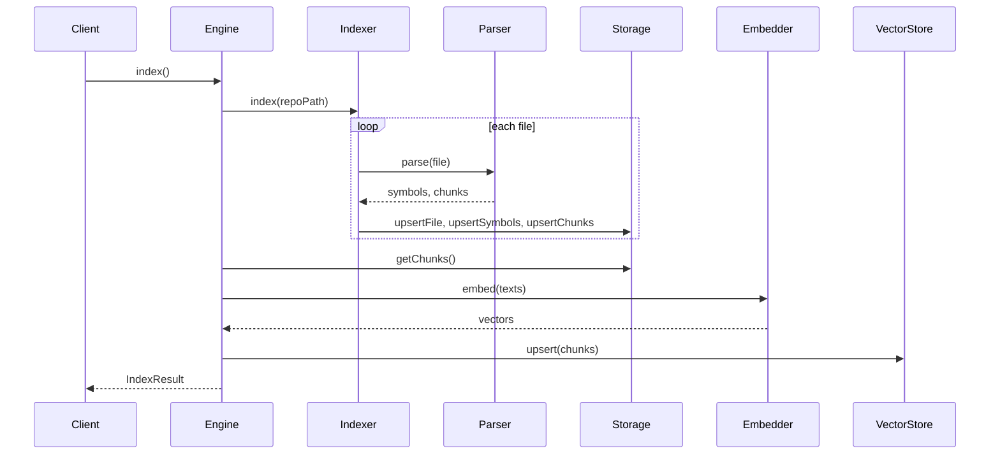
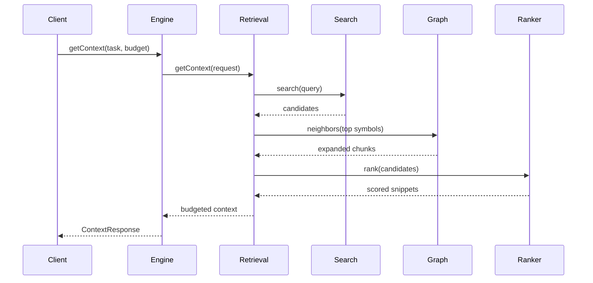

# Sequence Diagrams

## Indexing

```mermaid
sequenceDiagram
    participant Client
    participant Engine
    participant Indexer
    participant Parser
    participant Storage
    participant Embedder
    participant VectorStore

    Client->>Engine: index()
    Engine->>Indexer: index(repoPath)
    loop each file
        Indexer->>Parser: parse(file)
        Parser-->>Indexer: symbols, chunks
        Indexer->>Storage: upsertFile, upsertSymbols, upsertChunks
    end
    Engine->>Storage: getChunks()
    Engine->>Embedder: embed(texts)
    Embedder-->>Engine: vectors
    Engine->>VectorStore: upsert(chunks)
    Engine-->>Client: IndexResult
```

## Context retrieval

```mermaid
sequenceDiagram
    participant Client
    participant Engine
    participant Retrieval
    participant Search
    participant Graph
    participant Ranker

    Client->>Engine: getContext(task, budget)
    Engine->>Retrieval: getContext(request)
    Retrieval->>Search: search(query)
    Search-->>Retrieval: candidates
    Retrieval->>Graph: neighbors(top symbols)
    Graph-->>Retrieval: expanded chunks
    Retrieval->>Ranker: rank(candidates)
    Ranker-->>Retrieval: scored snippets
    Retrieval-->>Engine: budgeted context
    Engine-->>Client: ContextResponse
```
